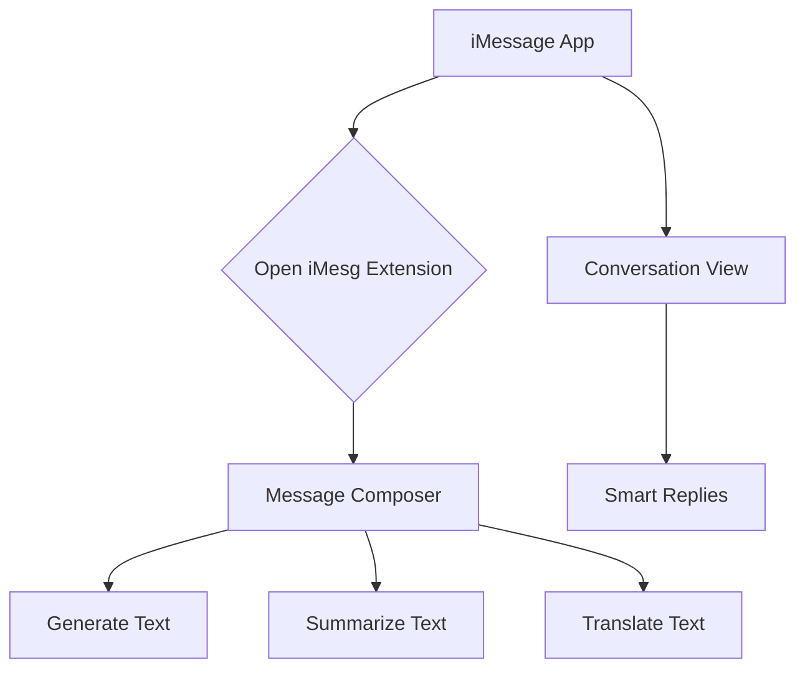

## 1. Product Overview
iMesg is an AI-powered iMessage assistant designed for the 'Build with TRAE x MiniMax' hackathon. It enhances the iMessage experience by providing intelligent message assistance, leveraging TRAE, MiniMax APIs, and the Photon iMessage Kit.

## 2. Core Features

### 2.1 User Roles
| Role | Registration Method | Core Permissions |
|---|---|---|
| iMessage User | Implicitly through iMessage | Access to all iMesg features within the iMessage app. |

### 2.2 Feature Module
Our iMessage assistant consists of the following main views:
1. **Message Composer**: AI-powered text generation, text summarization, and translation.
2. **Conversation View**: Real-time message analysis and smart replies.
3. **Settings**: User preferences for AI behavior.

### 2.3 Page Details
| Page Name | Module Name | Feature description |
|---|---|---|
| Message Composer | AI Text Generation | Generate text based on user prompts. |
| Message Composer | Text Summarization | Summarize long messages or articles shared in the conversation. |
| Message Composer | Translation | Translate incoming or outgoing messages. |
| Conversation View | Real-time Analysis | Provide insights on the tone and sentiment of the conversation. |
| Conversation View | Smart Replies | Suggest contextual replies based on the last message. |
| Settings | User Preferences | Allow users to customize the AI model, language, and other settings. |

## 3. Core Process
The user interacts with iMesg directly within the iMessage application. When composing a message, the user can tap the iMesg icon to access AI-powered text generation, summarization, and translation features. While viewing a conversation, iMesg will automatically provide smart reply suggestions.

## 4. User Interface Design

### 4.1 Design Style
- **Primary Color**: #007AFF (iMessage Blue)
- **Secondary Color**: #E5E5EA (Light Gray)
- **Button Style**: Flat with rounded corners.
- **Font**: System default (San Francisco).
- **Layout**: Seamlessly integrated with the native iMessage interface.
- **Icon Style**: Simple, clean, and recognizable icons that match the iOS style.

### 4.2 Page Design Overview
| Page Name | Module Name | UI Elements |
|---|---|---|
| Message Composer | AI Features | A compact view with buttons for "Generate", "Summarize", and "Translate". |
| Conversation View | Smart Replies | Suggested replies appear as tappable bubbles above the message input field. |

### 4.3 Responsiveness
The design will be mobile-first, specifically for the iMessage app on iOS devices.
