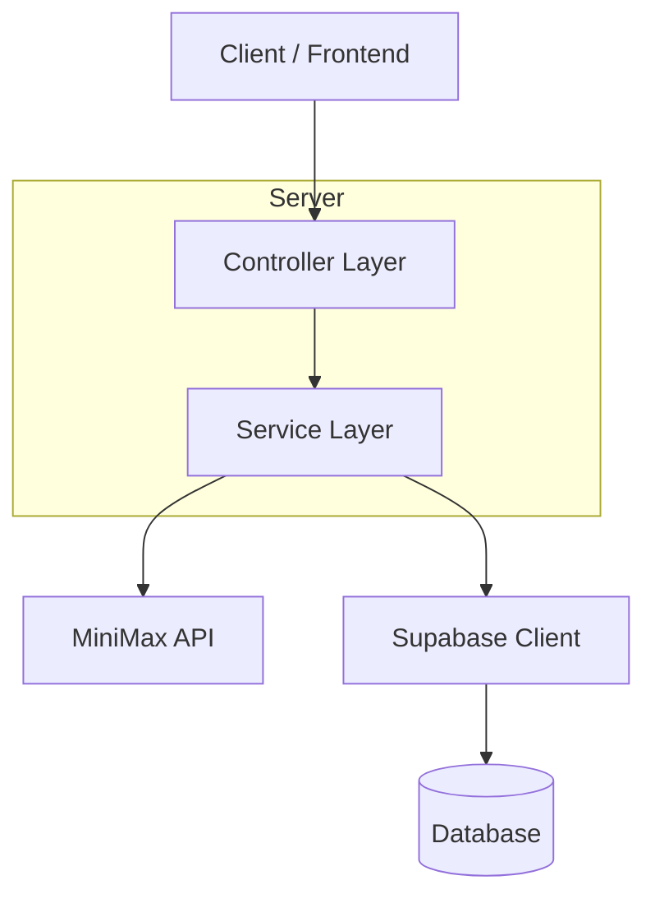
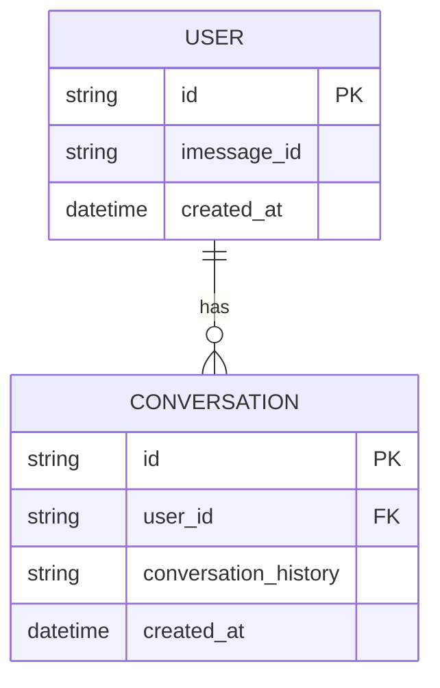

## 1. Architecture design

```mermaid
graph TD
  A[User Browser] --> B[React Native Frontend Application]
  B --> C[Backend Server (Node.js/Express)]
  C --> D[Supabase Database]
  C --> E[MiniMax API Service]

  subgraph "Frontend Layer"
      B
  end

  subgraph "Backend Layer"
      C
  end

  subgraph "Data Layer"
      D
  end

  subgraph "External Services"
      E
  end
```

## 2. Technology Description
- **Frontend**: React Native + Photon iMessage Kit
- **Backend**: Node.js + Express.js
- **Database**: Supabase (PostgreSQL)
- **AI Service**: MiniMax API
- **Initialization Tool**: create-react-native-app

## 3. Route definitions
As an iMessage extension, the application will not have traditional URL-based routes. Instead, it will have views:
| View | Purpose |
|---|---|
| MessageComposer | Provides AI assistance for writing messages. |
| ConversationView | Offers in-context features like smart replies. |
| Settings | Allows users to configure their preferences. |

## 4. API definitions

### 4.1 Core API

**POST /api/assist**

Request:
| Param Name| Param Type | isRequired | Description |
|---|---|---|---|
| type | string | true | The type of assistance requested ('generate', 'summarize', 'translate'). |
| text | string | true | The input text for the AI model. |
| conversation_history | array | false | An array of previous messages for context. |

Response:
| Param Name| Param Type | Description |
|---|---|---|
| result | string | The output from the AI model. |

Example Request:
```json
{
  "type": "generate",
  "text": "Write a happy birthday message to my friend Alex."
}
```

## 5. Server architecture diagram


## 6. Data model

### 6.1 Data model definition


### 6.2 Data Definition Language
**User Table (users)**
```sql
-- create table
CREATE TABLE users (
    id UUID PRIMARY KEY DEFAULT gen_random_uuid(),
    imessage_id VARCHAR(255) UNIQUE NOT NULL,
    created_at TIMESTAMP WITH TIME ZONE DEFAULT NOW()
);
```

**Conversation Table (conversations)**
```sql
-- create table
CREATE TABLE conversations (
    id UUID PRIMARY KEY DEFAULT gen_random_uuid(),
    user_id UUID REFERENCES users(id),
    conversation_history JSONB,
    created_at TIMESTAMP WITH TIME ZONE DEFAULT NOW()
);
```
