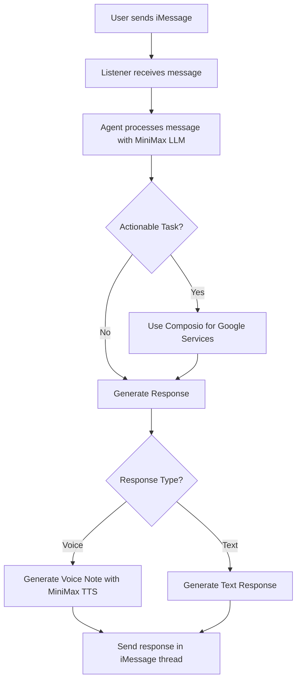

## 1. Product Overview
An iMessage AI assistant that helps you manage tasks, access information, and connect with other services directly within your conversations. This project is for the 'Build with TRAE x MiniMax Hackathon,' focusing on AI Agents for Productivity & Life Hacks.

## 2. Core Features

### 2.1 Feature Module
Our iMessage AI Assistant consists of the following core modules:
1.  **iMessage Interface**: Handles real-time message listening and manages communication within a dedicated agent thread.
2.  **AI Core**: Powers the intelligence, including task extraction from text, image analysis, and generating voice responses.
3.  **Service Integration**: Connects to external services like Google Calendar and Gmail to perform actions on the user's behalf.
4.  **Data Persistence**: Locally stores conversation context and extracted tasks for continuity.

### 2.2 Page Details
| Feature Area | Module Name | Feature description |
|---|---|---|
| iMessage Interaction | Real-time Message Processing | - Listens to incoming iMessages in real-time.   - Identifies messages specifically directed at the assistant. |
| iMessage Interaction | Dedicated Agent Thread | - Creates and communicates within a dedicated iMessage thread for all assistant-related interactions. |
| AI Processing | Task Extraction & Understanding | - Utilizes MiniMax LLM to analyze message content for actionable tasks, questions, and commands. |
| AI Processing | Image Analysis | - Employs the MiniMax Vision model to analyze and describe the content of images sent by the user. |
| AI Processing | Voice Note Response | - Uses MiniMax TTS to generate and send responses as voice notes for a more natural interaction. |
| Service Integration | Google Calendar & Gmail | - Connects to Google services via Composio to manage calendar events and read emails upon user request. |
| Data Management | Local Data Persistence | - Uses a local SQLite database to store conversation history and extracted tasks, maintaining context over time. |

## 3. Core Process
The primary user flow begins when a user sends an iMessage. The assistant's listener detects the message, and the agent core processes it using the MiniMax LLM. If the message contains an actionable task (e.g., "remind me to call John"), the agent may use Composio to interact with Google services. The assistant then formulates a text or voice response and sends it back to the user in a dedicated thread.

## 4. User Interface Design
### 4.1 Design Style
The user interface is the native Apple iMessage application. All design elements are inherited from the existing iMessage UI to ensure a seamless and familiar user experience.
-   **Primary Color**: iMessage Blue (`#007AFF`)
-   **Secondary Color**: iMessage Gray (`#E5E5EA`)
-   **Font**: San Francisco (Default for Apple platforms)
-   **Layout Style**: Standard chat bubbles
-   **Iconography**: Native Apple emojis

### 4.2 Page Design Overview
Not applicable, as the interface is the standard iMessage conversation view.

### 4.3 Responsiveness
The solution is inherently responsive as it operates within the native iMessage application across all supported Apple devices (macOS, iOS, iPadOS).
