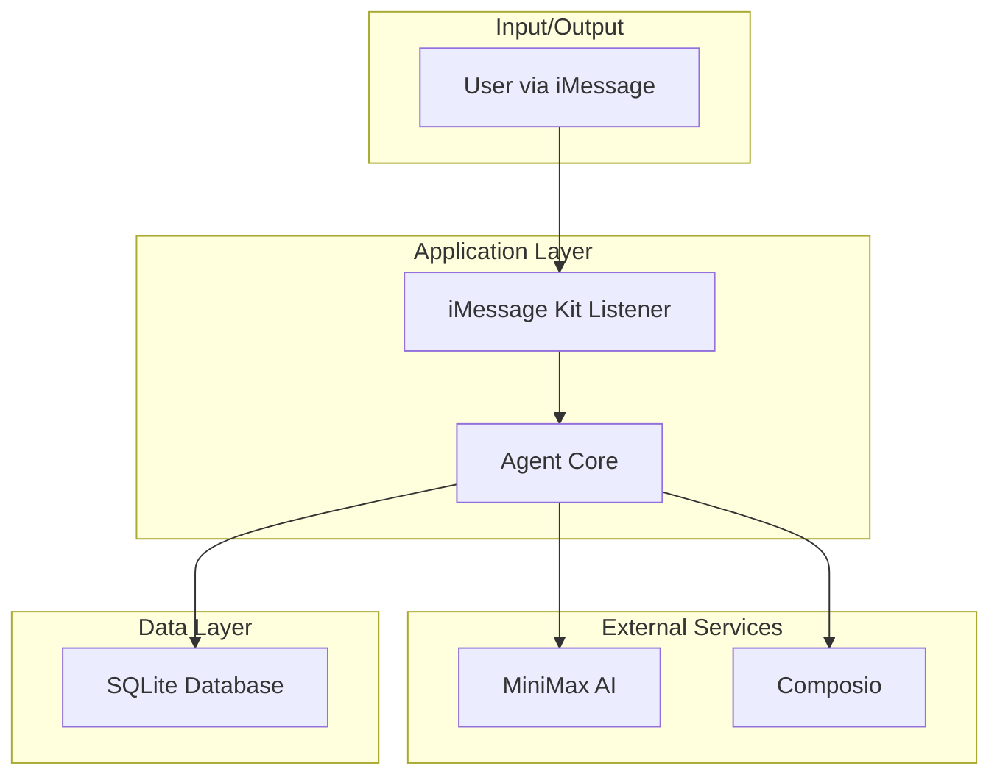
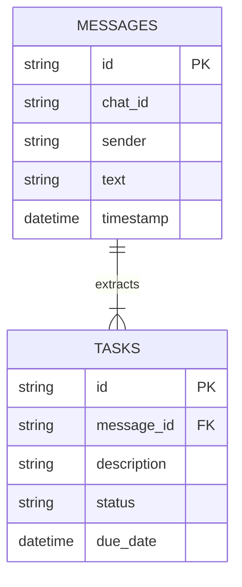

## 1. Architecture design



## 2. Technology Description
-   **Backend**: Bun (Node.js runtime)
-   **Language**: TypeScript
-   **Core Dependencies**: `@photon-ai/imessage-kit`, `better-sqlite3`, `@openai/api` (for MiniMax), `composio-core`, `dotenv`, `uuid`
-   **Initialization Tool**: `bun init`

## 3. Route definitions
Not applicable. This is a background service with no web-facing routes.

## 4. API definitions
This service does not expose a public API. It interacts with the following external services:
-   **MiniMax AI**: For natural language understanding, image analysis, and text-to-speech.
-   **Composio**: To connect to and interact with Google Calendar and Gmail APIs.

## 5. Server architecture diagram
The architecture is that of a background service, not a traditional web server. The main components are outlined in the diagram in Section 1. The `Agent Core` orchestrates the flow of data between the `iMessage Kit Listener`, external services, and the local database.

## 6. Data model

### 6.1 Data model definition



### 6.2 Data Definition Language
```sql
-- Messages table to store conversation history
CREATE TABLE messages (
    id TEXT PRIMARY KEY,
    chat_id TEXT NOT NULL,
    sender TEXT,
    text TEXT,
    timestamp DATETIME DEFAULT CURRENT_TIMESTAMP
);

-- Tasks table to store extracted tasks
CREATE TABLE tasks (
    id TEXT PRIMARY KEY,
    message_id TEXT,
    description TEXT NOT NULL,
    status TEXT DEFAULT 'pending',
    due_date DATETIME,
    FOREIGN KEY (message_id) REFERENCES messages(id)
);

CREATE INDEX idx_messages_chat_id ON messages(chat_id);
CREATE INDEX idx_tasks_status ON tasks(status);
```
