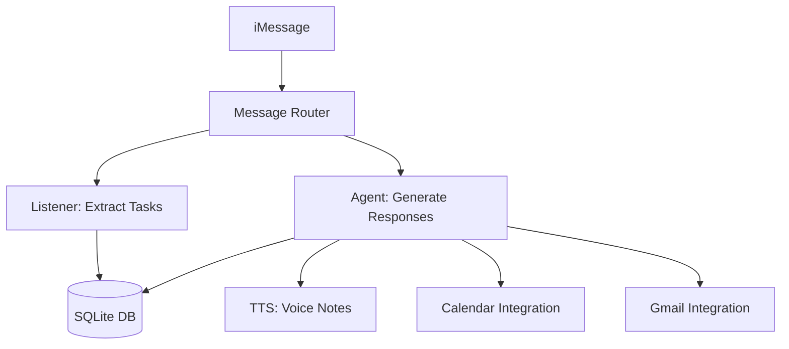

# iMessage AI Assistant: Specification

## Overview
iMesg is an AI-powered iMessage assistant that provides intelligent message assistance, task management, calendar integration, and proactive reminders using MiniMax AI models.

## System Architecture

## Module Specifications

### Core Modules
| Module | File | Description |
|--------|------|-------------|
| Configuration | [01-CONFIG.md](01-CONFIG.md) | Environment variables and app settings |
| MiniMax LLM | [02-MINIMAX-LLM.md](02-MINIMAX-LLM.md) | Text generation with M2.7 model |
| MiniMax TTS | [03-MINIMAX-TTS.md](03-MINIMAX-TTS.md) | Text-to-speech with Speech 2.8 |
| MiniMax Vision | [04-MINIMAX-VISION.md](04-MINIMAX-VISION.md) | Image analysis with vision |
| iMessage SDK | [05-IMESSAGE-SDK.md](05-IMESSAGE-SDK.md) | Send/receive iMessages |
| iMessage Router | [06-IMESSAGE-ROUTER.md](06-IMESSAGE-ROUTER.md) | Route messages to handlers |
| Database | [07-DATABASE.md](07-DATABASE.md) | SQLite persistence layer |

### Agent Modules
| Module | File | Description |
|--------|------|-------------|
| Personality | [08-AGENT-PERSONALITY.md](08-AGENT-PERSONALITY.md) | Nudge persona configuration |
| Context | [09-AGENT-CONTEXT.md](09-AGENT-CONTEXT.md) | Context assembly for responses |
| Handler | [10-AGENT-HANDLER.md](10-AGENT-HANDLER.md) | Intent classification and response |
| Agent Router | [11-AGENT-ROUTER.md](11-AGENT-ROUTER.md) | SDK to handler bridging |

### Proactive Engine
| Module | File | Description |
|--------|------|-------------|
| Proactive Engine | [12-PROACTIVE-ENGINE.md](12-PROACTIVE-ENGINE.md) | Rate limiting and deduplication |
| Triggers | [13-PROACTIVE-TRIGGERS.md](13-PROACTIVE-TRIGGERS.md) | Scheduled and event triggers |

### Integrations
| Module | File | Description |
|--------|------|-------------|
| Composio | [15-COMPOSIO.md](15-COMPOSIO.md) | Third-party integration framework |
| Calendar | [16-CALENDAR.md](16-CALENDAR.md) | Google Calendar integration |
| Gmail | [17-GMAIL.md](17-GMAIL.md) | Gmail integration |

### Listener
| Module | File | Description |
|--------|------|-------------|
| Extractor | [14-LISTENER-EXTRACTOR.md](14-LISTENER-EXTRACTOR.md) | Task extraction from messages |

## Technology Stack
- **Runtime**: Bun
- **Language**: TypeScript
- **iMessage**: `@photon-ai/imessage-kit`
- **Database**: `better-sqlite3`
- **AI**: MiniMax (M2.7, Speech 2.8)
- **Integrations**: `composio-core`

## Key Features
1. **Real-time Message Processing** - Monitor iMessage for new messages
2. **Task Extraction** - Identify actionable items from conversations
3. **Voice Responses** - Generate and send voice notes
4. **Calendar Integration** - Check schedule, find free time
5. **Gmail Integration** - Monitor inbox, get summaries
6. **Proactive Nudges** - Morning briefings, task reminders, meeting prep
7. **Image Analysis** - Understand photos sent in messages
